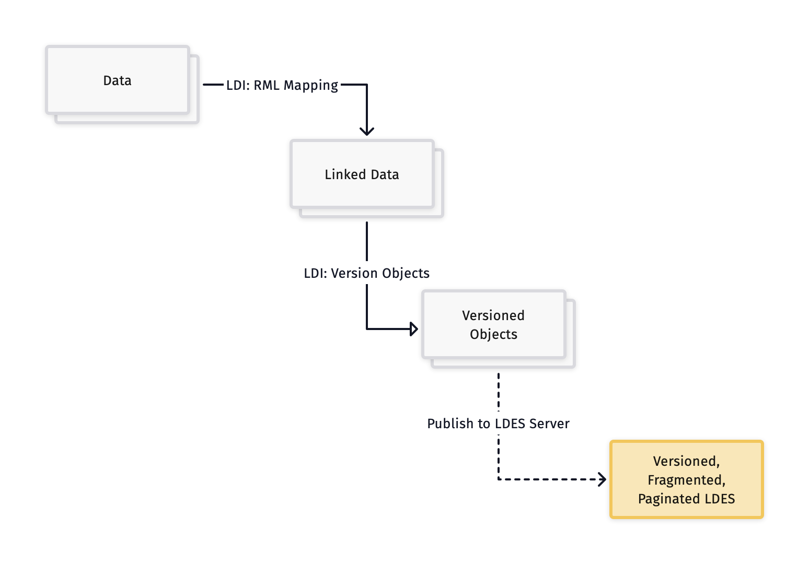

### Onboarding tutorial

Based on a few use cases, we try to teach you in a light-hearted way how to publish or consume an LDES. We do not go into depth about the different possible parameters in these tech docs, but we show a working configuration for the proposed use case. Detailed information about the technical parameters or configuration options can be found individually under sections of the building blocks.

